```python
import numpy as np
import pandas as pd
import math
from math import pi
from datetime import time, datetime
from os import path
from scipy import stats
from scipy.stats import shapiro
from statsmodels.stats.power import TTestIndPower
from matplotlib import pyplot as plt
import seaborn as sns
```


```python
%matplotlib inline
sns.set()
red = (255/255,103/255,103/255)
blue = (52/255,128/255,255/255)
```

# Performance Outcomes in NFL Quarterbacks Following Shoulder Injury

### Load Data

First we load our list of QBs, that we have downloaded and selected in the other notebook:


```python
case_qbs = pd.read_csv('qb-data/case_qbs.csv')
ctrl_qbs = pd.read_csv('qb-data/ctrl_qbs.csv')
inj_qbs = pd.read_csv('qb-data/injured_qbs.csv')
select_ctrls = {'Alex Smith': 'Michael Vick',
 'Andrew Luck': 'Joe Flacco',
 'Cam Newton': 'Robert Griffin III',
 'Chad Pennington': 'Tony Romo',
 'Don Majkowski': 'Erik Kramer',
 'Drew Brees': 'Peyton Manning',
 'Jay Cutler': 'Matt Schaub',
 'Jim McMahon': 'Jim Everett',
 'Jimmy Clausen': 'Kellen Clemens',
 'Kelly Holcomb': 'Donald Hollas',
 'Mark Sanchez': 'Kyle Orton',
 'Matt Moore': 'Geno Smith',
 'Matthew Stafford': 'Drew Bledsoe',
 'Rich Gannon': 'Tommy Kramer',
 'Ryan Leaf': 'Tim Couch',
 'Steve McNair': 'Donovan McNabb',
 'Tom Brady': 'Brett Favre',
 'Troy Aikman': 'John Elway',
 'Gary Danielson': 'Jim Kelly'}
inj_ctrls = {'Marc Bulger': 'Shaun Hill', 
 'Derek Anderson': 'Matt Cassel', 
 'Kyle Boller': 'Blaine Gabbert', 
 'Bruce Gradkowski': 'Brady Quinn', 
 'Jameis Winston': 'Josh Freeman',
 'Ben Roethlisberger': 'Aaron Rodgers',
 'Jim Miller': 'Hugh Millen', 
 'Scott Mitchell': 'Doug Johnson',
 'Gary Hogeboom': 'Steve Grogan', 
 'David Archer': 'Todd Blackledge', 
 'Tony Eason': 'Jeff Hostetler'}
```

Methods to access our CSV files of performance statistics:


```python
def underscore(name):
    sep = name.find(' ')
    return name[:sep]+'_'+name[sep+1:]

def get_qb_stats(name, attempts=1, average=False):
    filesuff = '{}.csv'.format(underscore(name))
    if path.exists('qb-data/case/'+filesuff):
        df = pd.read_csv('qb-data/case/'+filesuff)
    elif path.exists('qb-data/control/'+filesuff):
        df = pd.read_csv('qb-data/control/'+filesuff)
    else:
        return 
    df = df[df['Att']>attempts]
    df.reset_index(drop=True, inplace=True)
    if average:
        return df.mean()
    return df
```


```python
get_qb_stats('Tom Brady', average=False).tail()
```


<div>
<style scoped>
    .dataframe tbody tr th:only-of-type {
        vertical-align: middle;
    }

    .dataframe tbody tr th {
        vertical-align: top;
    }

    .dataframe thead th {
        text-align: right;
    }
</style>
<table border="1" class="dataframe">
  <thead>
    <tr style="text-align: right;">
      <th></th>
      <th>Year</th>
      <th>Date</th>
      <th>Age</th>
      <th>Cmp</th>
      <th>Att</th>
      <th>Cmp%</th>
      <th>Yds</th>
      <th>TD</th>
      <th>Int</th>
      <th>Rate</th>
      <th>Sk</th>
      <th>Yds.1</th>
      <th>Y/A</th>
      <th>AY/A</th>
    </tr>
  </thead>
  <tbody>
    <tr>
      <th>295</th>
      <td>2020</td>
      <td>2020-11-23</td>
      <td>43.112</td>
      <td>26.0</td>
      <td>48.0</td>
      <td>54.17</td>
      <td>216.0</td>
      <td>2.0</td>
      <td>2.0</td>
      <td>62.5</td>
      <td>1.0</td>
      <td>7.0</td>
      <td>4.50</td>
      <td>3.46</td>
    </tr>
    <tr>
      <th>296</th>
      <td>2020</td>
      <td>2020-11-29</td>
      <td>43.118</td>
      <td>27.0</td>
      <td>41.0</td>
      <td>65.85</td>
      <td>345.0</td>
      <td>3.0</td>
      <td>2.0</td>
      <td>96.1</td>
      <td>1.0</td>
      <td>3.0</td>
      <td>8.41</td>
      <td>7.68</td>
    </tr>
    <tr>
      <th>297</th>
      <td>2020</td>
      <td>2020-12-13</td>
      <td>43.132</td>
      <td>15.0</td>
      <td>23.0</td>
      <td>65.22</td>
      <td>196.0</td>
      <td>2.0</td>
      <td>0.0</td>
      <td>120.9</td>
      <td>0.0</td>
      <td>0.0</td>
      <td>8.52</td>
      <td>10.26</td>
    </tr>
    <tr>
      <th>298</th>
      <td>2020</td>
      <td>2020-12-20</td>
      <td>43.139</td>
      <td>31.0</td>
      <td>45.0</td>
      <td>68.89</td>
      <td>390.0</td>
      <td>2.0</td>
      <td>0.0</td>
      <td>110.4</td>
      <td>3.0</td>
      <td>25.0</td>
      <td>8.67</td>
      <td>9.56</td>
    </tr>
    <tr>
      <th>299</th>
      <td>2020</td>
      <td>2020-12-26</td>
      <td>43.145</td>
      <td>22.0</td>
      <td>27.0</td>
      <td>81.48</td>
      <td>348.0</td>
      <td>4.0</td>
      <td>0.0</td>
      <td>158.3</td>
      <td>1.0</td>
      <td>7.0</td>
      <td>12.89</td>
      <td>15.85</td>
    </tr>
  </tbody>
</table>
</div>


Methods to select QB games by date, selecting all games or # of games before or after the date:


```python
def format_date(date):
    month_i = date.find('/', 3)
    day_i = date.find('/')
    month = date[:day_i]
    day = date[day_i+1:month_i]
    if len(day)==1:
        day = '0'+day
    if len(month)==1:
        month = '0'+month
    newdate = date[-4:]+'-'+month+'-'+day
    return newdate

def get_qb_games(name, date, all_games=False, games=0, average=False, before=False, after=False):
    df = get_qb_stats(name)
    if df is None:
        return
    if '/' in date:
        date = format_date(date)
    i = 0
    for d in df['Date']:
        if d>=date:
            break
        else:
            i+=1 
    if all_games:
        if before and not after:
            df = df.iloc[0:i,:].reset_index(drop=True)
        elif after and not before:
            df = df.iloc[i:,:].reset_index(drop=True)
    else:
        if before:
            before_i = 0 if i-games<0 else i-games
            df = df.iloc[before_i:i,:].reset_index(drop=True)
        elif after:
            df = df.iloc[i:i+games,:].reset_index(drop=True)
        else: 
            df = df.iloc[i-games:i+games,:].reset_index(drop=True)   
    if average:
        newdf = pd.DataFrame(data={'Games': len(df), 'Age': [df['Age'].mean()], 'Cmp': [df['Cmp'].mean()], 'Att': [df['Att'].mean()], 'Cmp%': [df['Cmp%'].mean()], 'Yds': [df['Yds'].mean()], 'TD': [df['TD'].mean()], 'Int': [df['Int'].mean()], 'Rate': [df['Rate'].mean()], 'Sk': [df['Sk'].mean()], 'Yds.1': [df['Yds.1'].mean()], 'Y/A': [df['Y/A'].mean()], 'AY/A': [df['AY/A'].mean()]})
        return newdf
    else:
        return df 
```


```python
get_qb_games('Tom Brady', '12/30/2015', games=10, before=True)
```


<div>
<style scoped>
    .dataframe tbody tr th:only-of-type {
        vertical-align: middle;
    }

    .dataframe tbody tr th {
        vertical-align: top;
    }

    .dataframe thead th {
        text-align: right;
    }
</style>
<table border="1" class="dataframe">
  <thead>
    <tr style="text-align: right;">
      <th></th>
      <th>Year</th>
      <th>Date</th>
      <th>Age</th>
      <th>Cmp</th>
      <th>Att</th>
      <th>Cmp%</th>
      <th>Yds</th>
      <th>TD</th>
      <th>Int</th>
      <th>Rate</th>
      <th>Sk</th>
      <th>Yds.1</th>
      <th>Y/A</th>
      <th>AY/A</th>
    </tr>
  </thead>
  <tbody>
    <tr>
      <th>0</th>
      <td>2015</td>
      <td>2015-10-25</td>
      <td>38.083</td>
      <td>34.0</td>
      <td>54.0</td>
      <td>62.96</td>
      <td>355.0</td>
      <td>2.0</td>
      <td>0.0</td>
      <td>94.3</td>
      <td>3.0</td>
      <td>18.0</td>
      <td>6.57</td>
      <td>7.31</td>
    </tr>
    <tr>
      <th>1</th>
      <td>2015</td>
      <td>2015-10-29</td>
      <td>38.087</td>
      <td>26.0</td>
      <td>38.0</td>
      <td>68.42</td>
      <td>356.0</td>
      <td>4.0</td>
      <td>0.0</td>
      <td>133.2</td>
      <td>2.0</td>
      <td>14.0</td>
      <td>9.37</td>
      <td>11.47</td>
    </tr>
    <tr>
      <th>2</th>
      <td>2015</td>
      <td>2015-11-08</td>
      <td>38.097</td>
      <td>26.0</td>
      <td>39.0</td>
      <td>66.67</td>
      <td>299.0</td>
      <td>2.0</td>
      <td>1.0</td>
      <td>96.0</td>
      <td>0.0</td>
      <td>0.0</td>
      <td>7.67</td>
      <td>7.54</td>
    </tr>
    <tr>
      <th>3</th>
      <td>2015</td>
      <td>2015-11-15</td>
      <td>38.104</td>
      <td>26.0</td>
      <td>42.0</td>
      <td>61.90</td>
      <td>334.0</td>
      <td>2.0</td>
      <td>1.0</td>
      <td>92.8</td>
      <td>3.0</td>
      <td>5.0</td>
      <td>7.95</td>
      <td>7.83</td>
    </tr>
    <tr>
      <th>4</th>
      <td>2015</td>
      <td>2015-11-23</td>
      <td>38.112</td>
      <td>20.0</td>
      <td>39.0</td>
      <td>51.28</td>
      <td>277.0</td>
      <td>1.0</td>
      <td>1.0</td>
      <td>72.3</td>
      <td>1.0</td>
      <td>6.0</td>
      <td>7.10</td>
      <td>6.46</td>
    </tr>
    <tr>
      <th>5</th>
      <td>2015</td>
      <td>2015-11-29</td>
      <td>38.118</td>
      <td>23.0</td>
      <td>42.0</td>
      <td>54.76</td>
      <td>280.0</td>
      <td>3.0</td>
      <td>0.0</td>
      <td>99.3</td>
      <td>3.0</td>
      <td>18.0</td>
      <td>6.67</td>
      <td>8.10</td>
    </tr>
    <tr>
      <th>6</th>
      <td>2015</td>
      <td>2015-12-06</td>
      <td>38.125</td>
      <td>29.0</td>
      <td>56.0</td>
      <td>51.79</td>
      <td>312.0</td>
      <td>3.0</td>
      <td>2.0</td>
      <td>71.4</td>
      <td>4.0</td>
      <td>24.0</td>
      <td>5.57</td>
      <td>5.04</td>
    </tr>
    <tr>
      <th>7</th>
      <td>2015</td>
      <td>2015-12-13</td>
      <td>38.132</td>
      <td>22.0</td>
      <td>30.0</td>
      <td>73.33</td>
      <td>226.0</td>
      <td>2.0</td>
      <td>0.0</td>
      <td>116.8</td>
      <td>3.0</td>
      <td>29.0</td>
      <td>7.53</td>
      <td>8.87</td>
    </tr>
    <tr>
      <th>8</th>
      <td>2015</td>
      <td>2015-12-20</td>
      <td>38.139</td>
      <td>23.0</td>
      <td>35.0</td>
      <td>65.71</td>
      <td>267.0</td>
      <td>2.0</td>
      <td>0.0</td>
      <td>107.7</td>
      <td>2.0</td>
      <td>14.0</td>
      <td>7.63</td>
      <td>8.77</td>
    </tr>
    <tr>
      <th>9</th>
      <td>2015</td>
      <td>2015-12-27</td>
      <td>38.146</td>
      <td>22.0</td>
      <td>31.0</td>
      <td>70.97</td>
      <td>231.0</td>
      <td>1.0</td>
      <td>1.0</td>
      <td>89.6</td>
      <td>2.0</td>
      <td>10.0</td>
      <td>7.45</td>
      <td>6.65</td>
    </tr>
  </tbody>
</table>
</div>


Method to get QB stats before or after a specified QB age:


```python
def get_qb_stats_by_age(name, age, all_games=True, n_games=0, before=False, after=False):
    stats = get_qb_stats(name)
    if stats is None:
        return
    for a in stats['Age']:
        if a>age:
            qb_age = a
            break
    if age>a:
        return
    qb_date = stats[stats['Age']==qb_age]['Date'].to_string(index=False)[:] 
    if all_games:
        if after:
            result = get_qb_games(name, qb_date, all_games=True, average=True, after=True)
        else:
            result = get_qb_games(name, qb_date, all_games=True, average=True, before=True)
    else:
        if after:
            result = get_qb_games(name, qb_date, games=n_games, average=False, after=True)
        else:
            result = get_qb_games(name, qb_date, games=n_games, average=True, before=True)
    return result
```


```python
get_qb_stats_by_age('Tom Brady', 27.5, all_games=True, before=True)
```


<div>
<style scoped>
    .dataframe tbody tr th:only-of-type {
        vertical-align: middle;
    }

    .dataframe tbody tr th {
        vertical-align: top;
    }

    .dataframe thead th {
        text-align: right;
    }
</style>
<table border="1" class="dataframe">
  <thead>
    <tr style="text-align: right;">
      <th></th>
      <th>Games</th>
      <th>Age</th>
      <th>Cmp</th>
      <th>Att</th>
      <th>Cmp%</th>
      <th>Yds</th>
      <th>TD</th>
      <th>Int</th>
      <th>Rate</th>
      <th>Sk</th>
      <th>Yds.1</th>
      <th>Y/A</th>
      <th>AY/A</th>
    </tr>
  </thead>
  <tbody>
    <tr>
      <th>0</th>
      <td>64</td>
      <td>25.580125</td>
      <td>19.421875</td>
      <td>31.53125</td>
      <td>60.684063</td>
      <td>217.578125</td>
      <td>1.515625</td>
      <td>0.8125</td>
      <td>86.8625</td>
      <td>2.03125</td>
      <td>12.296875</td>
      <td>6.84875</td>
      <td>6.680781</td>
    </tr>
  </tbody>
</table>
</div>


Now we can get our case qbs and their controls average stats before and after their surgery age, or respective index age:


```python
def compile_before_after(caseslist, controlslist):
    compare_qbs = pd.DataFrame()
    for i, row in caseslist.iterrows():
        case_prev = get_qb_stats_by_age(row.Name, row.SurgeryAge, before=True)
        case_post = get_qb_stats_by_age(row.Name, row.SurgeryAge, after=True)
        ctrl_prev = get_qb_stats_by_age(controlslist[row.Name], row.SurgeryAge, before=True)
        ctrl_post = get_qb_stats_by_age(controlslist[row.Name], row.SurgeryAge, after=True)
        case = case_prev.append(case_post)
        case['Name'] = row.Name
        ctrl = ctrl_prev.append(ctrl_post)
        ctrl['Name'] = controlslist[row.Name]
        compare_qbs = compare_qbs.append(case)
        compare_qbs = compare_qbs.append(ctrl)
    compare_qbs.reset_index(drop=True, inplace=True)
    cols = list(compare_qbs.columns)
    cols = cols[-1:] + cols[:-1]
    compare_qbs = compare_qbs[cols]
    return compare_qbs
```


```python
cases_and_controls = compile_before_after(case_qbs, select_ctrls)
cases_and_controls.head()
```


<div>
<style scoped>
    .dataframe tbody tr th:only-of-type {
        vertical-align: middle;
    }

    .dataframe tbody tr th {
        vertical-align: top;
    }

    .dataframe thead th {
        text-align: right;
    }
</style>
<table border="1" class="dataframe">
  <thead>
    <tr style="text-align: right;">
      <th></th>
      <th>Name</th>
      <th>Games</th>
      <th>Age</th>
      <th>Cmp</th>
      <th>Att</th>
      <th>Cmp%</th>
      <th>Yds</th>
      <th>TD</th>
      <th>Int</th>
      <th>Rate</th>
      <th>Sk</th>
      <th>Yds.1</th>
      <th>Y/A</th>
      <th>AY/A</th>
    </tr>
  </thead>
  <tbody>
    <tr>
      <th>0</th>
      <td>Alex Smith</td>
      <td>30</td>
      <td>22.115333</td>
      <td>14.500000</td>
      <td>26.600000</td>
      <td>55.359667</td>
      <td>155.966667</td>
      <td>0.633333</td>
      <td>1.033333</td>
      <td>65.130000</td>
      <td>2.666667</td>
      <td>16.600000</td>
      <td>5.914000</td>
      <td>4.574667</td>
    </tr>
    <tr>
      <th>1</th>
      <td>Alex Smith</td>
      <td>140</td>
      <td>30.130007</td>
      <td>19.942857</td>
      <td>31.142857</td>
      <td>64.533857</td>
      <td>220.021429</td>
      <td>1.271429</td>
      <td>0.542857</td>
      <td>92.314286</td>
      <td>2.485714</td>
      <td>13.842857</td>
      <td>7.185571</td>
      <td>7.294429</td>
    </tr>
    <tr>
      <th>2</th>
      <td>Michael Vick</td>
      <td>43</td>
      <td>22.765023</td>
      <td>11.906977</td>
      <td>22.209302</td>
      <td>53.791163</td>
      <td>153.930233</td>
      <td>0.837209</td>
      <td>0.604651</td>
      <td>78.306977</td>
      <td>2.534884</td>
      <td>15.093023</td>
      <td>6.885116</td>
      <td>6.555116</td>
    </tr>
    <tr>
      <th>3</th>
      <td>Michael Vick</td>
      <td>85</td>
      <td>29.514729</td>
      <td>15.211765</td>
      <td>26.552941</td>
      <td>57.080353</td>
      <td>186.352941</td>
      <td>1.141176</td>
      <td>0.729412</td>
      <td>82.440000</td>
      <td>2.423529</td>
      <td>14.435294</td>
      <td>7.050353</td>
      <td>6.871059</td>
    </tr>
    <tr>
      <th>4</th>
      <td>Andrew Luck</td>
      <td>70</td>
      <td>24.857086</td>
      <td>22.428571</td>
      <td>37.871429</td>
      <td>59.812429</td>
      <td>272.542857</td>
      <td>1.885714</td>
      <td>0.971429</td>
      <td>88.327143</td>
      <td>2.228571</td>
      <td>14.142857</td>
      <td>7.285571</td>
      <td>7.185143</td>
    </tr>
  </tbody>
</table>
</div>


Lets split them up into individual DataFrames for now:


```python
def get_case_control_prev_post(caseslist, controlslist):
    compare = compile_before_after(caseslist, controlslist)
    droplist = []
    for i in range(len(compare)):
        if i not in range(3,len(compare),4):
            droplist.append(i)
    ctrl_post = compare.drop(index=droplist)
    droplist = []
    for i in range(len(compare)):
        if i not in range(2,len(compare),4):
            droplist.append(i)
    ctrl_prev = compare.drop(index=droplist)
    droplist = []
    for i in range(len(compare)):
        if i not in range(1,len(compare),4):
            droplist.append(i)
    case_post = compare.drop(index=droplist)
    droplist = []
    for i in range(len(compare)):
        if i not in range(0,len(compare),4):
            droplist.append(i)
    case_prev = compare.drop(index=droplist)
    ctrl_post.reset_index(drop=True, inplace=True)
    ctrl_prev.reset_index(drop=True, inplace=True)
    case_post.reset_index(drop=True, inplace=True)
    case_prev.reset_index(drop=True, inplace=True)
    return case_prev, case_post, ctrl_prev, ctrl_post
```


```python
case_prev, case_post, ctrl_prev, ctrl_post = get_case_control_prev_post(case_qbs, select_ctrls)
case_prev.head()
```


<div>
<style scoped>
    .dataframe tbody tr th:only-of-type {
        vertical-align: middle;
    }

    .dataframe tbody tr th {
        vertical-align: top;
    }

    .dataframe thead th {
        text-align: right;
    }
</style>
<table border="1" class="dataframe">
  <thead>
    <tr style="text-align: right;">
      <th></th>
      <th>Name</th>
      <th>Games</th>
      <th>Age</th>
      <th>Cmp</th>
      <th>Att</th>
      <th>Cmp%</th>
      <th>Yds</th>
      <th>TD</th>
      <th>Int</th>
      <th>Rate</th>
      <th>Sk</th>
      <th>Yds.1</th>
      <th>Y/A</th>
      <th>AY/A</th>
    </tr>
  </thead>
  <tbody>
    <tr>
      <th>0</th>
      <td>Alex Smith</td>
      <td>30</td>
      <td>22.115333</td>
      <td>14.500000</td>
      <td>26.600000</td>
      <td>55.359667</td>
      <td>155.966667</td>
      <td>0.633333</td>
      <td>1.033333</td>
      <td>65.130000</td>
      <td>2.666667</td>
      <td>16.600000</td>
      <td>5.914000</td>
      <td>4.574667</td>
    </tr>
    <tr>
      <th>1</th>
      <td>Andrew Luck</td>
      <td>70</td>
      <td>24.857086</td>
      <td>22.428571</td>
      <td>37.871429</td>
      <td>59.812429</td>
      <td>272.542857</td>
      <td>1.885714</td>
      <td>0.971429</td>
      <td>88.327143</td>
      <td>2.228571</td>
      <td>14.142857</td>
      <td>7.285571</td>
      <td>7.185143</td>
    </tr>
    <tr>
      <th>2</th>
      <td>Cam Newton</td>
      <td>93</td>
      <td>24.641366</td>
      <td>18.387097</td>
      <td>31.483871</td>
      <td>58.929032</td>
      <td>234.107527</td>
      <td>1.462366</td>
      <td>0.838710</td>
      <td>88.080645</td>
      <td>2.376344</td>
      <td>18.290323</td>
      <td>7.569247</td>
      <td>7.420538</td>
    </tr>
    <tr>
      <th>3</th>
      <td>Chad Pennington</td>
      <td>41</td>
      <td>26.918659</td>
      <td>17.512195</td>
      <td>26.609756</td>
      <td>63.908537</td>
      <td>197.341463</td>
      <td>1.292683</td>
      <td>0.658537</td>
      <td>93.358537</td>
      <td>1.634146</td>
      <td>10.000000</td>
      <td>7.691707</td>
      <td>7.488293</td>
    </tr>
    <tr>
      <th>4</th>
      <td>Don Majkowski</td>
      <td>44</td>
      <td>24.859818</td>
      <td>16.704545</td>
      <td>30.113636</td>
      <td>53.530909</td>
      <td>208.659091</td>
      <td>1.159091</td>
      <td>1.045455</td>
      <td>73.731818</td>
      <td>2.727273</td>
      <td>15.886364</td>
      <td>6.847955</td>
      <td>5.980909</td>
    </tr>
  </tbody>
</table>
</div>


```python
inj_prev, inj_post, inj_ctrl_prev, inj_ctrl_post = get_case_control_prev_post(inj_qbs, inj_ctrls)
```

# Output QB Stats

Get the QB passer rating prior to surgery:


```python
case_prev[['Name','Rate']]
```


<div>
<style scoped>
    .dataframe tbody tr th:only-of-type {
        vertical-align: middle;
    }

    .dataframe tbody tr th {
        vertical-align: top;
    }

    .dataframe thead th {
        text-align: right;
    }
</style>
<table border="1" class="dataframe">
  <thead>
    <tr style="text-align: right;">
      <th></th>
      <th>Name</th>
      <th>Rate</th>
    </tr>
  </thead>
  <tbody>
    <tr>
      <th>0</th>
      <td>Alex Smith</td>
      <td>65.130000</td>
    </tr>
    <tr>
      <th>1</th>
      <td>Andrew Luck</td>
      <td>88.327143</td>
    </tr>
    <tr>
      <th>2</th>
      <td>Cam Newton</td>
      <td>88.080645</td>
    </tr>
    <tr>
      <th>3</th>
      <td>Chad Pennington</td>
      <td>93.358537</td>
    </tr>
    <tr>
      <th>4</th>
      <td>Don Majkowski</td>
      <td>73.731818</td>
    </tr>
    <tr>
      <th>5</th>
      <td>Drew Brees</td>
      <td>85.933898</td>
    </tr>
    <tr>
      <th>6</th>
      <td>Jay Cutler</td>
      <td>86.086331</td>
    </tr>
    <tr>
      <th>7</th>
      <td>Jim McMahon</td>
      <td>81.054000</td>
    </tr>
    <tr>
      <th>8</th>
      <td>Jimmy Clausen</td>
      <td>56.384615</td>
    </tr>
    <tr>
      <th>9</th>
      <td>Kelly Holcomb</td>
      <td>73.268421</td>
    </tr>
    <tr>
      <th>10</th>
      <td>Mark Sanchez</td>
      <td>74.555738</td>
    </tr>
    <tr>
      <th>11</th>
      <td>Matt Moore</td>
      <td>69.642105</td>
    </tr>
    <tr>
      <th>12</th>
      <td>Matthew Stafford</td>
      <td>67.623077</td>
    </tr>
    <tr>
      <th>13</th>
      <td>Rich Gannon</td>
      <td>70.777083</td>
    </tr>
    <tr>
      <th>14</th>
      <td>Ryan Leaf</td>
      <td>41.180000</td>
    </tr>
    <tr>
      <th>15</th>
      <td>Steve McNair</td>
      <td>81.100000</td>
    </tr>
    <tr>
      <th>16</th>
      <td>Tom Brady</td>
      <td>84.741667</td>
    </tr>
    <tr>
      <th>17</th>
      <td>Troy Aikman</td>
      <td>61.416000</td>
    </tr>
    <tr>
      <th>18</th>
      <td>Gary Danielson</td>
      <td>76.981250</td>
    </tr>
  </tbody>
</table>
</div>


Get QB performance metric means and standard deviations:


```python
cohort = inj_ctrl_post
for metric in ['Rate', 'Cmp', 'Att', 'Cmp%', 'Yds', 'TD', 'Int', 'Sk', 'Yds.1', 'Y/A', 'AY/A']:
    print('%0.4f'%cohort[metric].mean()+' +/- '+'%0.4f'%cohort[metric].std())
```

    76.9540 +/- 11.8350
    14.7846 +/- 4.3202
    25.9278 +/- 6.1679
    56.0140 +/- 5.6810
    173.4442 +/- 51.0495
    0.9758 +/- 0.5093
    0.7395 +/- 0.2855
    1.9950 +/- 0.5334
    13.2433 +/- 3.5240
    6.5251 +/- 0.6900
    5.9338 +/- 1.2980
    

Get difference in pre/post performance


```python
for metric in ['Rate', 'Cmp', 'Att', 'Cmp%', 'Yds', 'TD', 'Int', 'Sk', 'Yds.1', 'Y/A', 'AY/A']:
    diff = inj_ctrl_post[metric]-inj_ctrl_prev[metric]
    print('%0.4f'%diff.mean()+' +/- '+'%0.4f'%diff.std())
```

    -0.0600 +/- 6.6877
    0.9437 +/- 4.7622
    2.0128 +/- 7.6151
    -1.3578 +/- 4.7623
    9.0099 +/- 46.6216
    -0.0240 +/- 0.3253
    -0.1636 +/- 0.3235
    -0.0432 +/- 1.0923
    -0.0413 +/- 6.4434
    -0.4008 +/- 0.5816
    0.3455 +/- 1.3582
    

### Output QB Tables


```python
surg_qbs = case_qbs
surg_qbs['Control'] = list(select_ctrls.values())
new_cols = ['Name', 'Birthday', 'Year', 'Age', 'Surgery', 'SurgeryAge', 'Experience', 'Control']
surg_qbs = surg_qbs[new_cols]
surg_qbs.head()
```


<div>
<style scoped>
    .dataframe tbody tr th:only-of-type {
        vertical-align: middle;
    }

    .dataframe tbody tr th {
        vertical-align: top;
    }

    .dataframe thead th {
        text-align: right;
    }
</style>
<table border="1" class="dataframe">
  <thead>
    <tr style="text-align: right;">
      <th></th>
      <th>Name</th>
      <th>Birthday</th>
      <th>Year</th>
      <th>Age</th>
      <th>Surgery</th>
      <th>SurgeryAge</th>
      <th>Experience</th>
      <th>Control</th>
    </tr>
  </thead>
  <tbody>
    <tr>
      <th>0</th>
      <td>Alex Smith</td>
      <td>5/7/1984</td>
      <td>2005</td>
      <td>21</td>
      <td>11/6/2008</td>
      <td>24.517808</td>
      <td>3</td>
      <td>Michael Vick</td>
    </tr>
    <tr>
      <th>1</th>
      <td>Andrew Luck</td>
      <td>9/12/1989</td>
      <td>2012</td>
      <td>23</td>
      <td>1/19/2017</td>
      <td>27.372603</td>
      <td>5</td>
      <td>Joe Flacco</td>
    </tr>
    <tr>
      <th>2</th>
      <td>Cam Newton</td>
      <td>5/11/1989</td>
      <td>2011</td>
      <td>22</td>
      <td>3/30/2017</td>
      <td>27.904110</td>
      <td>6</td>
      <td>Robert Griffin III</td>
    </tr>
    <tr>
      <th>3</th>
      <td>Chad Pennington</td>
      <td>6/26/1976</td>
      <td>2000</td>
      <td>24</td>
      <td>2/4/2005</td>
      <td>28.630137</td>
      <td>5</td>
      <td>Tony Romo</td>
    </tr>
    <tr>
      <th>4</th>
      <td>Don Majkowski</td>
      <td>2/25/1964</td>
      <td>1987</td>
      <td>23</td>
      <td>12/13/1990</td>
      <td>26.816438</td>
      <td>3</td>
      <td>Erik Kramer</td>
    </tr>
  </tbody>
</table>
</div>


```python
nonsurg_qbs = inj_qbs
nonsurg_qbs['Control'] = list(inj_ctrls.values())
nonsurg_qbs = nonsurg_qbs[new_cols]
nonsurg_qbs.head()
```


<div>
<style scoped>
    .dataframe tbody tr th:only-of-type {
        vertical-align: middle;
    }

    .dataframe tbody tr th {
        vertical-align: top;
    }

    .dataframe thead th {
        text-align: right;
    }
</style>
<table border="1" class="dataframe">
  <thead>
    <tr style="text-align: right;">
      <th></th>
      <th>Name</th>
      <th>Birthday</th>
      <th>Year</th>
      <th>Age</th>
      <th>Surgery</th>
      <th>SurgeryAge</th>
      <th>Experience</th>
      <th>Control</th>
    </tr>
  </thead>
  <tbody>
    <tr>
      <th>0</th>
      <td>Marc Bulger</td>
      <td>4/5/1977</td>
      <td>2002</td>
      <td>25</td>
      <td>10/17/2005</td>
      <td>28.553425</td>
      <td>3</td>
      <td>Shaun Hill</td>
    </tr>
    <tr>
      <th>1</th>
      <td>Derek Anderson</td>
      <td>6/15/1983</td>
      <td>2006</td>
      <td>23</td>
      <td>12/26/2006</td>
      <td>23.547945</td>
      <td>0</td>
      <td>Matt Cassel</td>
    </tr>
    <tr>
      <th>2</th>
      <td>Kyle Boller</td>
      <td>6/17/1981</td>
      <td>2003</td>
      <td>22</td>
      <td>8/16/2008</td>
      <td>27.183562</td>
      <td>5</td>
      <td>Blaine Gabbert</td>
    </tr>
    <tr>
      <th>3</th>
      <td>Bruce Gradkowski</td>
      <td>1/27/1983</td>
      <td>2006</td>
      <td>23</td>
      <td>11/28/2010</td>
      <td>27.854795</td>
      <td>4</td>
      <td>Brady Quinn</td>
    </tr>
    <tr>
      <th>4</th>
      <td>Jameis Winston</td>
      <td>1/6/1994</td>
      <td>2015</td>
      <td>21</td>
      <td>10/15/2017</td>
      <td>23.789041</td>
      <td>2</td>
      <td>Josh Freeman</td>
    </tr>
  </tbody>
</table>
</div>


```python
surg_qbs.to_csv('qb-data/surg_qb_table.csv')
nonsurg_qbs.to_csv('qb-data/nonsurg_qb_table.csv')
```

### Verify Normal Distribution

Lets take the whole population of NFL QBs - 269 in total, and look at the distribution of statistics:


```python
def get_all_qb_career_stats(caseslist, controlslist):
    all_qbs = get_qb_stats('Alex Smith', average=True)
    all_qbs = all_qbs.to_frame().T
    for i, row in caseslist.iterrows():
        qb_stats = get_qb_stats(row.Name, average=True)
        if i != 0:
            all_qbs = all_qbs.append(qb_stats, ignore_index=True)
    for i, row in controlslist.iterrows():
        qb_stats = get_qb_stats(row.Name, average=True)
        if stats is not None:
            all_qbs = all_qbs.append(qb_stats, ignore_index=True)
    return all_qbs
```


```python
all_qb_stats = get_all_qb_career_stats(case_qbs, ctrl_qbs)
```


```python
stat_names = {'Games': 'Games', 'Age': 'Age', 'Cmp': 'Pass Completions', 'Att': 'Pass Attempts', 'Cmp%': 'Pass Completion Percentage', 
             'Yds': 'Passing Yards', 'TD': 'Passing Touchdowns', 'Int': 'Interceptions', 'Rate': 'Passer Rating', 'Sk': 'Sacks', 
             'Yds.1': 'Yards Lost to Sacks', 'Y/A': 'Yards per Pass Attempt', 'AY/A': 'Adjusted Yards per Pass Attempt'}
```


```python
def plot_hist_by_var(all_qbs, var):
    plt.figure(figsize=(10,6))
    mu, sigma = all_qbs[var].mean(), all_qbs[var].std()
    n, bins, patches = plt.hist(all_qbs[var], 30, density=True, alpha=0.75, color=blue)
    x = np.linspace(mu - 3*sigma, mu + 3*sigma, 100)
    plt.plot(x, stats.norm.pdf(x, mu, sigma), color=red)
    plt.xlabel(stat_names[var])
    plt.ylabel('Frequency')
    plt.title('Distribution of QB {}'.format(stat_names[var]))
    plt.show()
```

We can see that the average Passer Rating for the entire population of NFL QBs follows a normal distribution quite well:


```python
plot_hist_by_var(all_qb_stats, 'Rate')
```


    
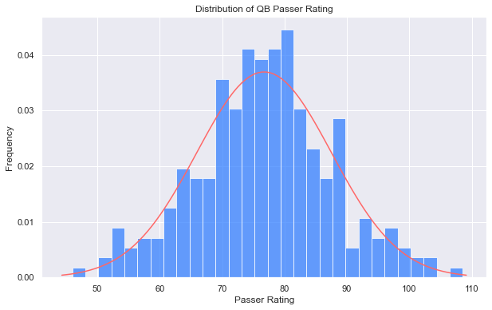
    


We can plug in other performance statistics we capture to check those too, let's try pass attempts:


```python
plot_hist_by_var(all_qb_stats, 'Att')
```


    

    


We can also check the distribution of our samples, the case and control QBs. We can do this using a Q-Q plot, which plots two sets of quantiles together so we can visually check if the dependent variable fits a normal distribution. This is important to verify so that we can make claims of statistically significant changes when performances deviate. 


```python
def probplot_by_var(qb_stats, var):
    fig = plt.figure(figsize=(10,6))
    ax = fig.add_subplot(111)
    stats.probplot(qb_stats[var], plot=plt)
    ax.get_lines()[0].set_markerfacecolor(blue)
    ax.get_lines()[1].set_color(red)
    plt.title('Probability Plot of {}'.format(stat_names[var]))
    plt.show()
```

Here are our case QBs passer ratings, prior to surgery, on a Q-Q plot. We can visually see that they fit the normal distribution well. 


```python
probplot_by_var(case_prev, 'Rate')
```


    
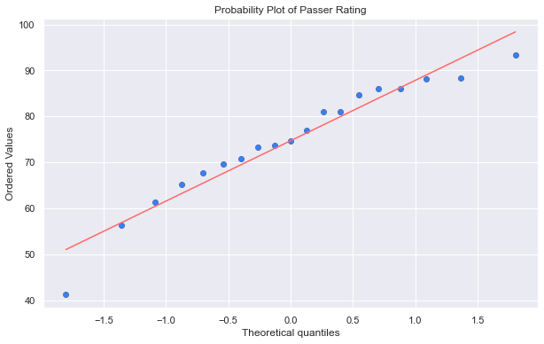
    


And all of our QBs:


```python
cohorts = [case_prev, case_post, ctrl_prev, ctrl_post]
cohort_names = ['Surgical: Previous', 'Surgical: Post', 'Surgical Control: Previous', 'Surgical Control: Post']
fig = plt.figure(figsize=(12,8))
for i in range(4):
    ax = fig.add_subplot(2,2,i+1)
    stats.probplot(cohorts[i]['Rate'], plot=plt)
    ax.get_lines()[0].set_markerfacecolor(blue)
    ax.get_lines()[1].set_color(red)
    ax.set_title(cohort_names[i])
    
plt.tight_layout(rect=[0, 0.03, 1, 0.95])
plt.suptitle('Surgical QB Probability Plots: Passer Rating')
plt.show()
```


    
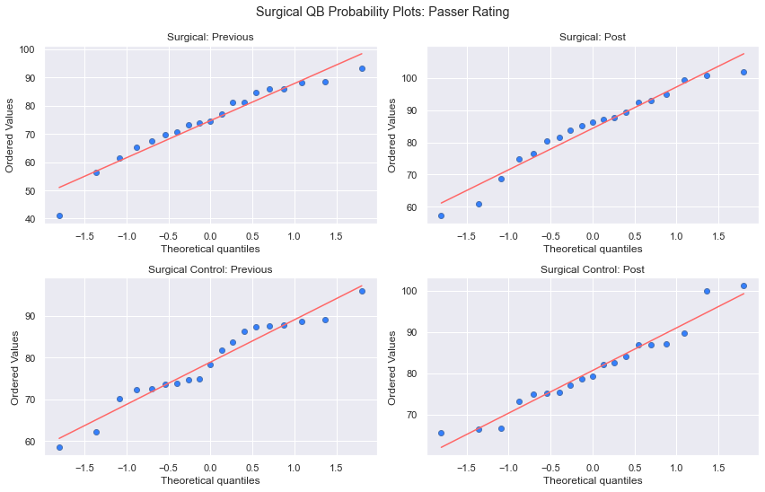
    


```python
cohorts = [inj_prev, inj_post, inj_ctrl_prev, inj_ctrl_post]
cohort_names = ['Non-Surgical: Previous', 'Non-Surgical: Post', 'Non-Surgical Control: Previous', 'Non-Surgical Control: Post']
fig = plt.figure(figsize=(12,8))
for i in range(4):
    ax = fig.add_subplot(2,2,i+1)
    stats.probplot(cohorts[i]['Rate'], plot=plt)
    ax.get_lines()[0].set_markerfacecolor(blue)
    ax.get_lines()[1].set_color(red)
    ax.set_title(cohort_names[i])
    
plt.tight_layout(rect=[0, 0.03, 1, 0.95])
plt.suptitle('Non-Surgical QB Probability Plots: Passer Rating')
plt.show()
```


    

    


## Shapiro-Wilk Test for Normality


```python
stat, p = shapiro(all_qb_stats['Rate'])
print('Stat: '+str(stat)+'   p-value: '+str(p))
```

    Stat: 0.9963261485099792   p-value: 0.7873727679252625
    


```python
stat, p = shapiro(inj_prev['AY/A'])
print('Stat: '+str(stat)+'   p-value: '+str(p))
```

    Stat: 0.9435199499130249   p-value: 0.562719464302063
    

## QB Performance Statistics

Now lets take a closer look at the performance statistics of QBs. We are looking at passing statistics that are consistently recorded for all of our QBs going back to 1980, these are: Passer Rating (Rate), Completion Percentage (Cmp%), Passing Yards (Yds), Completions (Cmp), Attempts (Att), Yards per Pass Attempt (Y/A), Adjusted Yards per Pass Attempt (AY/A), Passing Touchdowns (TD), Interceptions (Int), Sacks (Sk), and Yards Lost to Sacks (Yds.1). 

<br>

Passer Rating and Adjusted Yards per Attempt are calculations of several aggregated statistics. 

Passer Rating is calculated as follows:

(a + b + c + d) / 6 * 100

where

a = (CMP/ATT - 0.3) * 5

b = (YDS/ATT - 3) * 0.25

c = (TD/ATT) * 20

d = 2.375 - (INT/ATT * 25)

<br>

Adjusted Yards per Pass Attempt is calculated as follows:

AY/A = (YDS + 20 * TD - 45 * INT) / ATT

We can find an easier way to look at a QB's statistics than numbers on a chart, with a radial plot. Since statistics have very different ranges though, such as passing yards in the hundreds and interceptions per game less than 5, we have to look at these as percentages. Let's calculate a QB's statistics as a percentage of the population average. 


```python
def get_player_percent(player, df, all_qbs):
    res = df[df['Name']==player]
    res.set_index('Name', drop=True, inplace=True)
    res.drop(columns=['Age', 'Games'], inplace=True)
    res = res[['Rate', 'Cmp%', 'Yds', 'Cmp', 'Att', 'Y/A', 'AY/A', 'TD', 'Int', 'Sk', 'Yds.1']]
    for var in res.columns:
        avgvar = all_qbs[var].mean()
        res[var] = res[var]/avgvar
    return res
```


```python
smith_prev = get_player_percent('Alex Smith', case_prev, all_qb_stats)
smith_post = get_player_percent('Alex Smith', case_post, all_qb_stats)
smith_prev
```

    c:\anaconda3\lib\site-packages\pandas\core\frame.py:4308: SettingWithCopyWarning: 
    A value is trying to be set on a copy of a slice from a DataFrame
    
    See the caveats in the documentation: https://pandas.pydata.org/pandas-docs/stable/user_guide/indexing.html#returning-a-view-versus-a-copy
      return super().drop(
    


<div>
<style scoped>
    .dataframe tbody tr th:only-of-type {
        vertical-align: middle;
    }

    .dataframe tbody tr th {
        vertical-align: top;
    }

    .dataframe thead th {
        text-align: right;
    }
</style>
<table border="1" class="dataframe">
  <thead>
    <tr style="text-align: right;">
      <th></th>
      <th>Rate</th>
      <th>Cmp%</th>
      <th>Yds</th>
      <th>Cmp</th>
      <th>Att</th>
      <th>Y/A</th>
      <th>AY/A</th>
      <th>TD</th>
      <th>Int</th>
      <th>Sk</th>
      <th>Yds.1</th>
    </tr>
    <tr>
      <th>Name</th>
      <th></th>
      <th></th>
      <th></th>
      <th></th>
      <th></th>
      <th></th>
      <th></th>
      <th></th>
      <th></th>
      <th></th>
      <th></th>
    </tr>
  </thead>
  <tbody>
    <tr>
      <th>Alex Smith</th>
      <td>0.848928</td>
      <td>0.970117</td>
      <td>0.848582</td>
      <td>0.922007</td>
      <td>0.980547</td>
      <td>0.882464</td>
      <td>0.787074</td>
      <td>0.603743</td>
      <td>1.128319</td>
      <td>1.263911</td>
      <td>1.160729</td>
    </tr>
  </tbody>
</table>
</div>


Lets plot Alex Smith's statistics before and after his surgery, as a percentage of the average NFL QB statistics.


```python
def radar_plot(df1, df2, df3=None, df4=None, prevpost=False, max_val=1.5):    
    label1 = df1.index[0]+' (Previous)' if prevpost else df1.index[0]
    label2 = df2.index[0]+' (Post)' if prevpost else df2.index[0]
    if df3 is not None and df4 is not None:
        plt.figure(figsize=(18,18))
        ax = plt.subplot(121, polar=True)
    else: 
        plt.figure(figsize=(14,8))
        ax = plt.subplot(111, polar=True)
        plt.title('{} vs {}: % of NFL Average'.format(label1, label2))

    categories=list(df1)
    N = len(categories)
    angles = [n / float(N) * 2 * pi for n in range(N)]
    angles += angles[:1]
    plt.xticks(angles[:-1], categories, color='black', size=12)
    ax.set_rlabel_position(0)
    yticks = [max_val*i/6 for i in range(1,6)]
    plt.yticks(yticks, [str(e) for e in yticks], color='grey', size=14)
    plt.ylim(0,max_val)
    colors = ['blue','red']
    
    values1 = df1.values.flatten().tolist()
    values1 += values1[:1]
    ax.plot(angles, values1, linewidth=1, linestyle='solid', color=colors[0], label=label1)
    ax.fill(angles, values1, color=colors[0], alpha=0.1)
    values2 = df2.values.flatten().tolist()
    values2 += values2[:1]
    ax.plot(angles, values2, linewidth=1, linestyle='solid', color=colors[1], label=label2)
    ax.fill(angles, values2, color=colors[1], alpha=0.1)
    plt.legend(loc=0, bbox_to_anchor=(0.1, 0.1), prop={'size': 13})
    
    if df3 is not None and df4 is not None:
        plt.title('{} vs {}: Previous, % of NFL Average'.format(label1, label2))
        ax = plt.subplot(122, polar=True)
        plt.xticks(angles[:-1], categories, color='black', size=12)
        ax.set_rlabel_position(0)
        yticks = [max_val*i/6 for i in range(1,6)]
        plt.yticks(yticks, [str(e) for e in yticks], color='grey', size=14)
        plt.ylim(0,max_val)
        values1 = df3.values.flatten().tolist()
        values1 += values1[:1]
        ax.plot(angles, values1, linewidth=1, linestyle='solid', color=colors[0], label=df3.index[0])
        ax.fill(angles, values1, color=colors[0], alpha=0.1)
        values2 = df4.values.flatten().tolist()
        values2 += values2[:1]
        ax.plot(angles, values2, linewidth=1, linestyle='solid', color=colors[1], label=df4.index[0])
        ax.fill(angles, values2, color=colors[1], alpha=0.1)
        plt.legend(loc=0, bbox_to_anchor=(0.1, 0.1), prop={'size': 13})
        plt.title('{} vs {}: Post, % of NFL Average'.format(df3.index[0], df4.index[0]))
    plt.show()
```


```python
radar_plot(smith_prev, smith_post, prevpost=True)
```


    
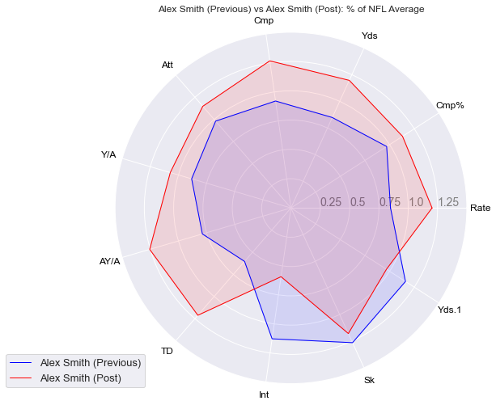
    


Or we can compare two different QBs:


```python
vick_prev = get_player_percent('Michael Vick', ctrl_prev, all_qb_stats)
```

    c:\anaconda3\lib\site-packages\pandas\core\frame.py:4308: SettingWithCopyWarning: 
    A value is trying to be set on a copy of a slice from a DataFrame
    
    See the caveats in the documentation: https://pandas.pydata.org/pandas-docs/stable/user_guide/indexing.html#returning-a-view-versus-a-copy
      return super().drop(
    


```python
radar_plot(smith_prev, vick_prev)
```


    
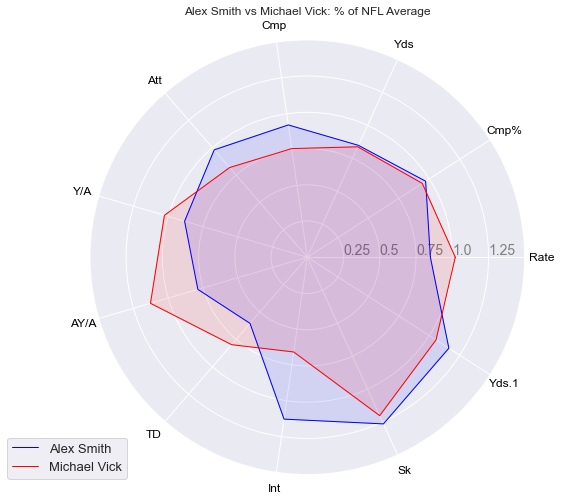
    


And now lets look at Alex Smith and his control, Michael Vick, for their previous and post surgery/index performances.


```python
vick_post = get_player_percent('Michael Vick', ctrl_post, all_qb_stats)
radar_plot(smith_prev, vick_prev, smith_post, vick_post)
```


    
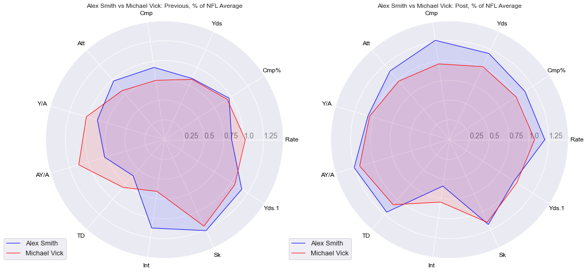
    


## Case QBs Pre and Post Surgery

The next step is to examine the performance statistics of our case QBs before and after their surgeries. We can look at the cohort as a whole. 


```python
def plot_pre_post(case_prev, case_post, var):
    var_conv = {'Rate': 9, 'Games': 1, 'Cmp': 3, 'Att': 4, 'Cmp%': 5, 'Yds': 6, 'TD': 7, 'Int': 8, 'Sk': 10, 'Yds.1': 11, 'Y/A': 12, 'AY/A': 13}
    var_name = var
    var = var_conv[var]
    fig, (ax1, ax2) = plt.subplots(1,2,figsize=(10,6))
    for i in range(len(case_prev)):
        ax1.scatter(i/36, case_prev.iloc[i,var], color=blue, alpha=0.75)
        ax1.scatter(1+i/36, case_post.iloc[i,var], color=red, alpha=0.75)
    ax1.plot([0,0.5], [case_prev.iloc[:,var].mean(), case_prev.iloc[:,var].mean()], color=blue, linewidth=3)
    ax1.plot([1,1.5], [case_post.iloc[:,var].mean(), case_post.iloc[:,var].mean()], color=red, linewidth=3)
    
    ax1.set_xlim(-0.5,2)
    ax1.set_xticks([.25,1.25])
    ax1.set_xticklabels(['Previous', 'Post'])
    ax1.set_ylabel(stat_names[var_name])

    for i in range(len(case_prev)):
        ax2.scatter(1, case_prev.iloc[i,var], color=blue, alpha=0.75)
        ax2.scatter(2, case_post.iloc[i,var], color=red, alpha=0.75)
        if case_post.iloc[i,var] - case_prev.iloc[i,var] > 0:
            c = 'green'
        else:
            c = 'red'
        ax2.plot([1, 2], [case_prev.iloc[i,var], case_post.iloc[i,var]], color=c, linewidth=0.5, alpha=0.5)
    ax2.set_xlim(0.5,2.5)
    ax2.set_xticks([1,2])
    ax2.set_xticklabels(['Previous', 'Post'])

    return ax1, ax2
```


```python
plot_pre_post(case_prev, case_post, 'Rate')
plt.suptitle('Surgical QB Passer Rating')
plt.show()
```


    

    


And their controls:


```python
plot_pre_post(ctrl_prev, ctrl_post, 'Rate')
plt.suptitle('Surgical Control QB Passer Rating')
plt.show()
```


    

    


Compare that with the decline in performance seen in quarterbacks who did not have surgical intervention.


```python
plot_pre_post(inj_prev, inj_post, 'Rate')
plt.suptitle('Non-Surgical QB Passer Rating')
plt.show()
```


    
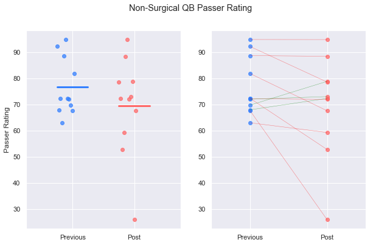
    


Non-surgical quarterback controls maintained their average performance over the same timespan. 


```python
plot_pre_post(inj_ctrl_prev, inj_ctrl_post, 'Rate')
plt.suptitle('Non-Surgical Control QB Passer Rating')
plt.show()
```


    
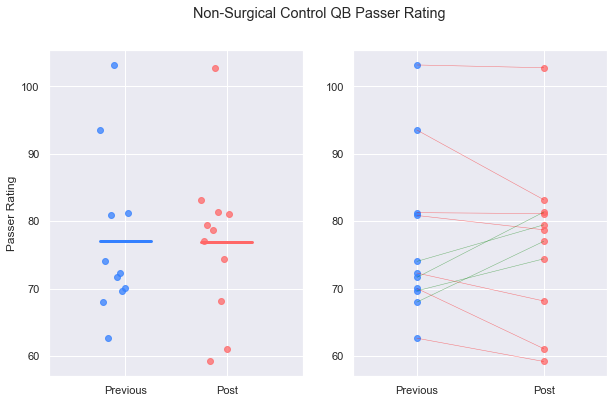
    


Plotting the groups on the same graph helps make comparisons.


```python
def plot_case_control(case_prev, case_post, ctrl_prev, ctrl_post, var):
    var_conv = {'Rate': 9, 'Games': 1, 'Cmp': 3, 'Att': 4, 'Cmp%': 5, 'Yds': 6, 'TD': 7, 'Int': 8, 'Sk': 10, 'Yds.1': 11, 'Y/A': 12, 'AY/A': 13}
    var_name = var
    var = var_conv[var]
    length = len(case_prev)
    fig, ax = plt.subplots(figsize=(10,6))
    if len(case_prev)!=len(ctrl_prev):
        for i in range(len(case_prev)):
            ax.scatter(1.5+i/length, case_prev.iloc[i,var], color=red, alpha=0.75)
            ax.scatter(6+i/length, case_post.iloc[i,var], color=red, marker='^', alpha=0.75)
        for j in range(len(ctrl_prev)):
            ax.scatter(3+j/length, ctrl_prev.iloc[j,var], color=blue, alpha=0.75)
            ax.scatter(7.5+j/length, ctrl_post.iloc[j,var], color=blue, marker='^', alpha=0.75)
    else:
        for i in range(len(case_prev)):
            ax.scatter(1.5+i/length, case_prev.iloc[i,var], color=red, alpha=0.75)
            ax.scatter(3+i/length, ctrl_prev.iloc[i,var], color=blue, alpha=0.75)
            ax.scatter(6+i/length, case_post.iloc[i,var], color=red, marker='^', alpha=0.75)
            ax.scatter(7.5+i/length, ctrl_post.iloc[i,var], color=blue, marker='^', alpha=0.75)
    ax.plot([1.5,2.5], [case_prev.iloc[:,var].mean(), case_prev.iloc[:,var].mean()], color=red, linewidth=3)
    ax.plot([3,4], [ctrl_prev.iloc[:,var].mean(), ctrl_prev.iloc[:,var].mean()], color=blue, linewidth=3)
    ax.plot([6,7], [case_post.iloc[:,var].mean(), case_post.iloc[:,var].mean()], color=red, linestyle=':',linewidth=3)
    ax.plot([7.5,8.5], [ctrl_post.iloc[:,var].mean(), ctrl_post.iloc[:,var].mean()], color=blue, linestyle=':',linewidth=3)
    ax.set_xlim(0,10)
    ax.set_xticks([2.75, 7.25])
    ax.set_xticklabels(['Previous', 'Post'])
    ax.set_ylabel('{}'.format(stat_names[var_name]))
    return ax
```


```python
plot_case_control(case_prev, case_post, ctrl_prev, ctrl_post, 'Rate')
plt.title('Surgical vs Surgical Control Passer Rating')
plt.legend(['Surgical: Previous', 'Surgical Control: Previous', 'Surgical: Post', 'Surgical Control: Post'])
plt.show()
```


    
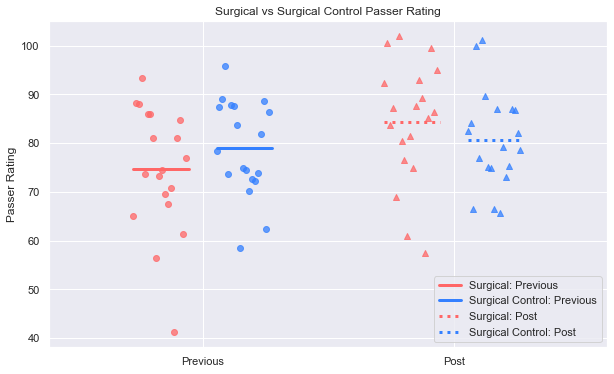
    


```python
plot_case_control(case_prev, case_post, inj_prev, inj_post, 'Rate')
plt.title('Surgical vs Non-Surgical Passer Rating')
plt.legend(['Surgical: Previous', 'Non-Surgical: Previous', 'Surgical: Post', 'Non-Surgical: Post'])
plt.show()
```


    
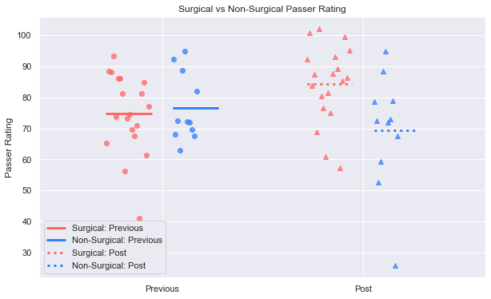
    


They can also be visualized on the same scale but with each cohort grouped to better understand the chart. 


```python
def plot_pre_post_two_cohorts(case_prev, case_post, ctrl_prev, ctrl_post, var):
    var_conv = {'Rate': 9, 'Games': 1, 'Cmp': 3, 'Att': 4, 'Cmp%': 5, 'Yds': 6, 'TD': 7, 'Int': 8, 'Sk': 10, 'Yds.1': 11, 'Y/A': 12, 'AY/A': 13}
    var_name = var
    var = var_conv[var]
    fig, (ax1, ax2) = plt.subplots(1,2,figsize=(10,6))
    for i in range(len(case_prev)):
        ax1.scatter(i/36, case_prev.iloc[i,var], color=blue, alpha=0.75)
        ax1.scatter(1+i/36, case_post.iloc[i,var], color=red, alpha=0.75)
    ax1.plot([0,0.5], [case_prev.iloc[:,var].mean(), case_prev.iloc[:,var].mean()], color=blue, linewidth=3)
    ax1.plot([1,1.5], [case_post.iloc[:,var].mean(), case_post.iloc[:,var].mean()], color=red, linewidth=3)
    
    ax1.set_xlim(-0.5,2)
    ax1.set_ylim(20,110)
    ax1.set_xticks([.25,1.25])
    ax1.set_xticklabels(['Previous', 'Post'])
    ax1.set_ylabel(stat_names[var_name])

    for i in range(len(ctrl_prev)):
        ax2.scatter(i/36, ctrl_prev.iloc[i,var], color=blue, alpha=0.75)
        ax2.scatter(1+i/36, ctrl_post.iloc[i,var], color=red, alpha=0.75)
    ax2.plot([0,0.5], [ctrl_prev.iloc[:,var].mean(), ctrl_prev.iloc[:,var].mean()], color=blue, linewidth=3)
    ax2.plot([1,1.5], [ctrl_post.iloc[:,var].mean(), ctrl_post.iloc[:,var].mean()], color=red, linewidth=3)
    
    ax2.set_xlim(-0.5,2)
    ax2.set_ylim(20,110)
    ax2.set_xticks([.25,1.25])
    ax2.set_xticklabels(['Previous', 'Post'])

    return ax1, ax2
```


```python
ax1, ax2 = plot_pre_post_two_cohorts(case_prev, case_post, ctrl_prev, ctrl_post, 'Rate')
ax1.set_title('Surgical')
ax2.set_title('Surgical Control')
plt.show()
```


    

    


```python
ax1, ax2 = plot_pre_post_two_cohorts(inj_prev, inj_post, inj_ctrl_prev, inj_ctrl_post, 'Rate')
ax1.set_title('Non-Surgical')
ax2.set_title('Non-Surgical Control')
plt.show()
```


    
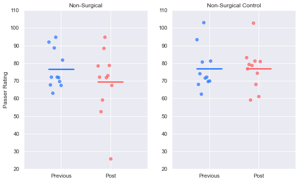
    


```python
ax1, ax2 = plot_pre_post_two_cohorts(case_prev, case_post, inj_prev, inj_post, 'Rate')
ax1.set_title('Surgical')
ax2.set_title('Non-Surgical')
plt.show()
```


    

    


## Statistical Analysis

We can output statistics by comparing cohorts using t-tests to identify statistically significant changes. The limiting factor of this data exploration is the small sample sizes. The NFL has very few quarterbacks playing substantial amounts of games at any given time, and fewer suffer serious shoulder injuries. Small sample sizes mean any comparison may not be appropriately powered to draw meaningful conclusions, so performing t-tests on individual statistics between cohorts should let us know if those conclusions are statistically significant. 


```python
def ttest_ind_gsa(case_prev, case_post, ctrl_prev, ctrl_post, var):
    n = len(case_prev)
    case_diff = case_post[var]-case_prev[var]
    ctrl_diff = ctrl_post[var]-ctrl_prev[var]
    diff = case_diff.mean()-ctrl_diff.mean()
    sign = '+' if diff>0 else ''
    ttest = stats.ttest_ind(case_diff, ctrl_diff);
    print(var+' %1.6f'%ttest[1])
    print('Case: %1.4f'%case_diff.mean()+'    Control: %1.4f'%ctrl_diff.mean()+'    Gain Score: '+sign+'%1.4f'%diff)
    print('   n: %1d'%n+'        t-value: %1.4f'%ttest[0]+'       p-value: %1.6f'%ttest[1])
    return(case_diff.mean()-ctrl_diff.mean(), ttest[1])

def ttest_rel_by_var(prev, post, var):
    n = len(prev)
    prev_mean = prev[var].mean()
    post_mean = post[var].mean()
    diff = post_mean-prev_mean
    sign='+' if diff>0 else ''
    ttest = stats.ttest_rel(prev[var], post[var])
    print(var+' %1.6f'%ttest[1])
    print('Previous: %1.4f'%prev_mean+'    Post: %1.4f'%post_mean+'    Difference: '+sign+'%1.4f'%diff)
    print('       n: %1d'%n+'      t-value: %1.4f'%ttest[0]+'       p-value: %1.4f'%ttest[1])
    return diff, ttest[1]

def ttest_ind_by_var(case, ctrl, var):
    n = len(case)
    case_mean = case[var].mean()
    ctrl_mean = ctrl[var].mean()
    diff = case_mean-ctrl_mean
    sign = '+' if diff>0 else ''
    ttest = stats.ttest_ind(case[var], ctrl[var])
    print(var+' %1.6f'%ttest[1])
    print('Case: %1.4f'%case_mean+'    Control: %1.4f'%ctrl_mean+'    Difference: '+sign+'%1.4f'%diff)
    print('   n: %1d'%n+'         t-value: %1.4f'%ttest[0]+'       p-value: %1.4f'%ttest[1])
    return diff, ttest[1]

def pooled_standard_deviation(sample1,sample2):
    n1, n2 = len(sample1), len(sample2)
    var1, var2 = np.var(sample1, ddof=1), np.var(sample2, ddof=1)
    numerator = ((n1-1) * var1) + ((n2-1) * var2)
    denominator = n1+n2-2
    return np.sqrt(numerator/denominator)

def Cohens_d(sample1, sample2):
    u1, u2 = np.mean(sample1), np.mean(sample2)
    s_pooled = pooled_standard_deviation(sample1, sample2)
    return ((u1 - u2) / s_pooled)

def calc_power(case_prev, case_post, ctrl_prev, ctrl_post, var='Rate', alpha=0.05, ratio=1):
    case_diff = case_post[var]-case_prev[var]
    ctrl_diff = ctrl_post[var]-ctrl_prev[var]
    effect_size = Cohens_d(case_diff, ctrl_diff)
    analysis = TTestIndPower()
    power = analysis.solve_power(effect_size, power=None, nobs1=len(case_diff), ratio=ratio, alpha=alpha)
    return power

var_list = ['Rate', 'Cmp', 'Att', 'Cmp%', 'Yds', 'TD', 'Int', 'Sk', 'Yds.1', 'Y/A', 'AY/A']
```

We can use a paired t-test to examine the effects of a shoulder injury and subsequent surgical or non-surgical intervention, since we are looking at the same related group at 2 different time points. 


```python
for var in var_list:
    d, t = ttest_rel_by_var(ctrl_prev, ctrl_post, var)
    # print(var, '%0.6f'%t)
```

    Rate 0.461702
    Previous: 78.9109    Post: 80.6392    Difference: +1.7282
           n: 19      t-value: -0.7521       p-value: 0.4617
    Cmp 0.916577
    Previous: 16.7589    Post: 16.6298    Difference: -0.1292
           n: 19      t-value: 0.1062       p-value: 0.9166
    Att 0.599649
    Previous: 28.7980    Post: 27.7740    Difference: -1.0240
           n: 19      t-value: 0.5343       p-value: 0.5996
    Cmp% 0.768927
    Previous: 57.5311    Post: 57.9723    Difference: +0.4411
           n: 19      t-value: -0.2983       p-value: 0.7689
    Yds 0.727577
    Previous: 198.5172    Post: 193.2015    Difference: -5.3158
           n: 19      t-value: 0.3538       p-value: 0.7276
    TD 0.698892
    Previous: 1.2078    Post: 1.1704    Difference: -0.0374
           n: 19      t-value: 0.3931       p-value: 0.6989
    Int 0.727993
    Previous: 0.9671    Post: 0.9202    Difference: -0.0469
           n: 19      t-value: 0.3533       p-value: 0.7280
    Sk 0.439128
    Previous: 2.0988    Post: 1.9381    Difference: -0.1607
           n: 19      t-value: 0.7912       p-value: 0.4391
    Yds.1 0.414806
    Previous: 13.8526    Post: 12.6836    Difference: -1.1690
           n: 19      t-value: 0.8347       p-value: 0.4148
    Y/A 0.700472
    Previous: 6.8588    Post: 6.7502    Difference: -0.1086
           n: 19      t-value: 0.3909       p-value: 0.7005
    AY/A 0.811582
    Previous: 6.1730    Post: 6.0977    Difference: -0.0753
           n: 19      t-value: 0.2419       p-value: 0.8116
    

For example, we can see the p-values for each performance statistic we are looking at. For the case control quarterbacks, it looks like none of the values range from ~0.41 to ~0.92, which are well above the chosen threshold of 0.05 to achieve statistical significance. However, given that none of these quarterbacks suffered an injury, their respective timepoints are arbitrary and so their previous and post performances understandably do not show a correlation. 

Now we can run the same t-test comparison on the case quarterbacks who DID have surgery:


```python

for var in var_list:
    d, t = ttest_rel_by_var(case_prev, case_post, var)
    # print(var, '%0.6f'%t)
```

    Rate 0.001764
    Previous: 74.7038    Post: 84.3321    Difference: +9.6283
           n: 19      t-value: -3.6670       p-value: 0.0018
    Cmp 0.000914
    Previous: 16.1113    Post: 18.7180    Difference: +2.6067
           n: 19      t-value: -3.9620       p-value: 0.0009
    Att 0.042101
    Previous: 27.9853    Post: 29.8854    Difference: +1.9000
           n: 19      t-value: -2.1880       p-value: 0.0421
    Cmp% 0.000009
    Previous: 56.6555    Post: 61.5307    Difference: +4.8753
           n: 19      t-value: -6.0958       p-value: 0.0000
    Yds 0.029363
    Previous: 185.4761    Post: 207.8934    Difference: +22.4174
           n: 19      t-value: -2.3667       p-value: 0.0294
    TD 0.019184
    Previous: 1.0627    Post: 1.2850    Difference: +0.2222
           n: 19      t-value: -2.5723       p-value: 0.0192
    Int 0.009196
    Previous: 1.0079    Post: 0.8136    Difference: -0.1943
           n: 19      t-value: 2.9173       p-value: 0.0092
    Sk 0.314115
    Previous: 2.1218    Post: 1.9864    Difference: -0.1354
           n: 19      t-value: 1.0356       p-value: 0.3141
    Yds.1 0.048746
    Previous: 14.2028    Post: 12.5181    Difference: -1.6847
           n: 19      t-value: 2.1139       p-value: 0.0487
    Y/A 0.234517
    Previous: 6.6000    Post: 6.8320    Difference: +0.2320
           n: 19      t-value: -1.2300       p-value: 0.2345
    AY/A 0.023223
    Previous: 5.5597    Post: 6.4094    Difference: +0.8496
           n: 19      t-value: -2.4806       p-value: 0.0232
    

Now we can see the p-values for the case group are much lower, and are under the 0.05 threshold for achieving statistical significance for the following: Passer Rating, Completions, Pass Attempts, Completion Percentage, Passing Yards, Touchdowns, Interceptions, Yards Lost to Sacks, and Adjusted Yards per Pass Attempt.

Next, rather than comparing one group at 2 timepoints, or 2 groups together at the same timepoint, we can attempt to compare the *change* in performance between groups. We can do so using a Gain Score Analysis, which takes the gain over the timepoint, or how much a group improved or declined, and compare that with the gain of another group. Here we can compare the *change* in performance for our case quarterbacks after surgery vs the *change* in performance of our control quarterbacks who were not injured. 


```python
for var in var_list:
    ttest_ind_gsa(case_prev, case_post, ctrl_prev, ctrl_post, var)
```

    Rate 0.029685
    Case: 9.6283    Control: 1.7282    Gain Score: +7.9000
       n: 19        t-value: 2.2642       p-value: 0.029685
    Cmp 0.055496
    Case: 2.6067    Control: -0.1292    Gain Score: +2.7359
       n: 19        t-value: 1.9791       p-value: 0.055496
    Att 0.173131
    Case: 1.9000    Control: -1.0240    Gain Score: +2.9240
       n: 19        t-value: 1.3898       p-value: 0.173131
    Cmp% 0.012268
    Case: 4.8753    Control: 0.4411    Gain Score: +4.4341
       n: 19        t-value: 2.6371       p-value: 0.012268
    Yds 0.127148
    Case: 22.4174    Control: -5.3158    Gain Score: +27.7331
       n: 19        t-value: 1.5615       p-value: 0.127148
    TD 0.050775
    Case: 0.2222    Control: -0.0374    Gain Score: +0.2596
       n: 19        t-value: 2.0209       p-value: 0.050775
    Int 0.327672
    Case: -0.1943    Control: -0.0469    Gain Score: -0.1474
       n: 19        t-value: -0.9923       p-value: 0.327672
    Sk 0.917193
    Case: -0.1354    Control: -0.1607    Gain Score: +0.0253
       n: 19        t-value: 0.1047       p-value: 0.917193
    Yds.1 0.750751
    Case: -1.6847    Control: -1.1690    Gain Score: -0.5158
       n: 19        t-value: -0.3201       p-value: 0.750751
    Y/A 0.317221
    Case: 0.2320    Control: -0.1086    Gain Score: +0.3406
       n: 19        t-value: 1.0143       p-value: 0.317221
    AY/A 0.053258
    Case: 0.8496    Control: -0.0753    Gain Score: +0.9249
       n: 19        t-value: 1.9985       p-value: 0.053258
    

We can also compare the *change* in quarterbacks who were injured and had surgery, vs those who were injured and did NOT have surgery:


```python
for var in var_list:
    ttest_ind_gsa(case_prev, case_post, inj_prev, inj_post, var)
```

    Rate 0.001462
    Case: 9.6283    Control: -7.1938    Gain Score: +16.8221
       n: 19        t-value: 3.5289       p-value: 0.001462
    Cmp 0.006175
    Case: 2.6067    Control: -1.4288    Gain Score: +4.0355
       n: 19        t-value: 2.9616       p-value: 0.006175
    Att 0.061708
    Case: 1.9000    Control: -2.0222    Gain Score: +3.9223
       n: 19        t-value: 1.9464       p-value: 0.061708
    Cmp% 0.000669
    Case: 4.8753    Control: -3.3497    Gain Score: +8.2249
       n: 19        t-value: 3.8256       p-value: 0.000669
    Yds 0.012728
    Case: 22.4174    Control: -23.1322    Gain Score: +45.5496
       n: 19        t-value: 2.6618       p-value: 0.012728
    TD 0.032769
    Case: 0.2222    Control: -0.1478    Gain Score: +0.3700
       n: 19        t-value: 2.2461       p-value: 0.032769
    Int 0.361604
    Case: -0.1943    Control: -0.0727    Gain Score: -0.1217
       n: 19        t-value: -0.9275       p-value: 0.361604
    Sk 0.726291
    Case: -0.1354    Control: -0.2408    Gain Score: +0.1054
       n: 19        t-value: 0.3536       p-value: 0.726291
    Yds.1 0.620250
    Case: -1.6847    Control: -2.6204    Gain Score: +0.9356
       n: 19        t-value: 0.5011       p-value: 0.620250
    Y/A 0.018463
    Case: 0.2320    Control: -0.6221    Gain Score: +0.8541
       n: 19        t-value: 2.5021       p-value: 0.018463
    AY/A 0.021520
    Case: 0.8496    Control: -0.7061    Gain Score: +1.5557
       n: 19        t-value: 2.4350       p-value: 0.021520
    

We can see that there is a statistically significant difference in Passer Rating, Completions, Completion Percentage, Passing Yards, Touchdowns, Yards per Pass Attempt, and Adjusted Yards per Pass Attempt. This indicates there is a potential positive effect on quarterbacks who have surgical intervention following a shoulder injury vs those who are treated non-surgically. 


```python
calc_power(case_prev, case_post, ctrl_prev, ctrl_post)
```


    0.5962222319545054


We can also calculate the power of this study. Statistical power is ideally greater than 0.80 for robust studies, but in small sample size studies it decreases. With a small sample size of NFL quarterbacks, it is expectedly underpowered, but it still allows for conclusions to be drawn. Comparing the case and control groups show the power of this t-test would be 0.5962. Comparable articles in the sports science literature have to use small sample sizes, for example Busfield et al. (https://www.arthroscopyjournal.org/article/S0749-8063(09)00193-5/fulltext).

## Conclusion

Despite small sample sizes, detailed performance metrics of NFL quarterbacks have allowed use to analyze performances with regards to shoulder injury and surgery. We can draw preliminary conclusions from the data that quarterbacks who suffer severe shoulder injuries who are treated surgically, tend to have statistically significant improvements in performances upon their return, when compared to their prior performance, and the performance of quarterbacks who were similarly injured but treated non-surgically. 

Further research may include examining greater sample sizes such as collegiate football quarterbacks, a wider range of performance metrics such as pass lengths, and stratification of cohorts based on specific shoulder injury. 

There are many limitations to this exploratory analysis. Primarily, the sample size is small, and therefore the power of these statistical tests is smaller. This means that the effects of surgical and non-surgical intervention on quarterback performance should be looked into further, as the data is tending towards surgical intervention improving outcomes but at a very low sample size. 

Further, there are numerous outside factors not considered here. Quarterback performances tend to improve with age up to a certain point, as players become more experienced. This could have confounding factors, such as quarterbacks who play more games getting injured more often, better quarterbacks being medically treated differently from other quarterbacks, quarterbacks retiring towards their peaks, etc. 

There are also only a few selected statistics used to draw conclusions here, which will no doubt increase in the future as tracking these performance metrics becomes more common and detailed. There will be opportunities in the future to take advantage of these metrics, or even increase the sample size by looking at college football for example. 

The data outputted from this exploratory data analysis has been used in the posters and pre-papers of "Performance Following Surgical and Non-surgical
Management of Shoulder Injury in NFL Quarterbacks" by Frederick Durrant B.S., George Durrant M.Eng., Martinus Megalla B.A., Teja Makkapati B.A., Nareena Imam B.A., Rocco Bassora M.D., and Frank Alberta M.D., in conjunction with Hackensack Meridian School of Medicine and the Rothman Orthopedic Institute. 

## Appendix

Assorted graphs indicating NFL QB performance over time vs controls of the population of all NFL QBs in the dataset.


```python
%matplotlib inline
sns.set()
red = (255/255,103/255,103/255)
# red = (.9, 0.4, 0.4)
blue = (52/255,128/255,255/255, 1)
# red = np.array([.9, .4, .4])
blue = np.array([.2, .4, .9])
red = np.array(red)
```


```python
def plot_case_control_by_year(cases, controls, var):
    plt.figure(figsize=(12,76))
    for i, row in cases.iterrows():
        plt.subplot(len(cases),1,i+1)
        ctrl = controls[row.Name]
        case_stats = get_qb_yearly_stats(row.Name)
        ctrl_stats = get_qb_yearly_stats(ctrl)
        case_prev = case_stats[case_stats['Age'] < row.SurgeryAge]
        case_post = case_stats[case_stats['Age'] > row.SurgeryAge]
        ctrl_prev = ctrl_stats[ctrl_stats['Age'] < row.SurgeryAge]
        ctrl_post = ctrl_stats[ctrl_stats['Age'] > row.SurgeryAge]
        labels= ['Case: Previous', 'Case: Post', 'Control: Previous', 'Control: Post', 'Surgery']

        print(case_prev.Age.shape)

        plt.scatter(case_prev.Age, case_prev['{}'.format(var)], c=red)
        plt.plot(case_prev.Age, case_prev['{}'.format(var)], c=red, linewidth=0.5)
        plt.scatter(case_post.Age, case_post['{}'.format(var)], c=red, marker='^')
        plt.plot(case_post.Age, case_post['{}'.format(var)], c=red, linestyle='-.', linewidth=1)
        plt.scatter(ctrl_prev.Age, ctrl_prev['{}'.format(var)], c=blue)
        plt.plot(ctrl_prev.Age, ctrl_prev['{}'.format(var)], c=blue, linewidth=0.5)
        plt.scatter(ctrl_post.Age, ctrl_post['{}'.format(var)], c=blue, marker='^')
        plt.plot(ctrl_post.Age, ctrl_post['{}'.format(var)], c=blue, linestyle='-.', linewidth=1)
        plt.axvline(x=row.SurgeryAge, color='green') 
        plt.plot([ctrl_prev.Age.values[-1],ctrl_post.Age.values[0]], [ctrl_prev['{}'.format(var)].values[-1],ctrl_post['{}'.format(var)].values[0]], color=blue, linestyle='-.',linewidth=0.5)
        plt.legend(labels, fontsize='medium', loc='lower right')
        plt.title('Case: {} vs Control: {}, for {} over Age'.format(row.Name, ctrl, var))
        plt.ylabel('{}'.format(var))
        plt.xlabel('Age')
    plt.tight_layout()
    plt.show()

def plot_case_pop_by_year(cases, all_controls, var):
    plt.figure(figsize=(12,76))
    for i, row in cases.iterrows():
        plt.subplot(len(cases),1,i+1)
        case_stats = get_qb_yearly_stats(row.Name)
        ctrl_stats = all_controls
        firstage = case_stats.iloc[0, 0]
        lastage = case_stats.iloc[-1, 0]
        case_prev = case_stats[case_stats['Age'] < row.SurgeryAge]
        case_post = case_stats[case_stats['Age'] > row.SurgeryAge]
        ctrl_prev = ctrl_stats[(ctrl_stats['Age'] < row.SurgeryAge) & (ctrl_stats['Age'] > firstage-1)]
        ctrl_post = ctrl_stats[(ctrl_stats['Age'] > row.SurgeryAge) & (ctrl_stats['Age'] < lastage+1)]
        labels= ['Case: Previous', 'Case: Post', 'Control: Previous', 'Control: Post', 'Surgery']

        plt.scatter(case_prev.Age, case_prev['{}'.format(var)], color=red)
        plt.plot(case_prev.Age, case_prev['{}'.format(var)], color=red, linewidth=0.5)
        plt.scatter(case_post.Age, case_post['{}'.format(var)], color=red, marker='^')
        plt.plot(case_post.Age, case_post['{}'.format(var)], color=red, linestyle='-.', linewidth=0.5)
        plt.scatter(ctrl_prev.Age, ctrl_prev['{}'.format(var)], color=blue)
        plt.plot(ctrl_prev.Age, ctrl_prev['{}'.format(var)], color=blue, linewidth=0.5)
        plt.scatter(ctrl_post.Age, ctrl_post['{}'.format(var)], color=blue, marker='^')
        plt.plot(ctrl_post.Age, ctrl_post['{}'.format(var)], color=blue, linestyle='-.', linewidth=0.5)
        plt.plot([ctrl_prev.Age.values[-1],ctrl_post.Age.values[0]], [ctrl_prev['{}'.format(var)].values[-1],ctrl_post['{}'.format(var)].values[0]], color=blue, linestyle='-.', linewidth=0.5)
        plt.axvline(x=row.SurgeryAge, color='green') 
        plt.legend(labels, fontsize='medium', loc='lower right')
        plt.title('{} vs All Controls, for {} over Age'.format(row.Name, var))
        plt.ylabel('{}'.format(var))
        plt.xlabel('Age')
    plt.tight_layout()
    plt.show()
    
def plot_avg_var_by_year(df, var):
    plt.figure(figsize=(18,6))
    plt.scatter(df.Age, df['{}'.format(var)], c=df.Count, cmap='coolwarm')
    plt.title('Average {} vs Age'.format(var))
    plt.xlabel('Age')
    plt.ylabel('{}'.format(var))
    plt.colorbar()
    if var=='Rate':
        plt.ylim(50, 120)
    plt.show()
    
def plot_case_ctrl_pop(case, ctrl, pop, var):
    plt.figure(figsize=(16,6))
    plt.scatter(case.Age, case['{}'.format(var)], color=red)
    plt.plot(case.Age, case['{}'.format(var)], color=red, linewidth=0.5)
    plt.scatter(ctrl.Age, ctrl['{}'.format(var)], color=blue, marker='^')
    plt.plot(ctrl.Age, ctrl['{}'.format(var)], color=blue, linewidth=0.5)
    plt.plot(pop.Age, pop['{}'.format(var)], color='green')
    plt.fill_between(pop.Age, pop['{}'.format(var)]+pop['Std{}'.format(var)], pop['{}'.format(var)]-pop['Std{}'.format(var)], color='grey', alpha=0.10)
    plt.title('Average {} vs Age'.format(var))
    plt.ylabel('{}'.format(var))
    plt.xlabel('Age')
    plt.legend(['Case', 'Control', 'Population'])
#     plt.legend(['Surgery', 'Non-Surgery', 'Population'])

def get_qb_yearly_stats(name):
    result = pd.DataFrame()
    stats = get_qb_stats(name)
    if stats is None:
        return
    curr_age = math.floor(stats['Age'][0])    
    first = 0
    for i, row in stats.iterrows():
        if math.floor(row.Age) == curr_age+1:
            year = stats.iloc[first:i, :].mean()
            year['Age'] = math.floor(year['Age'])
            year['Games'] = i-first
            result = result.append(year, ignore_index=True)
            curr_age = math.floor(row.Age)
            first = i   
        
        elif math.floor(row.Age) > curr_age+1:
            year = stats.iloc[first:i, :].mean()
            year['Age'] = math.floor(year['Age'])
            year['Games'] = i-first
            result = result.append(year, ignore_index=True)
            blank = pd.Series(dtype='float64');
            blank['Age'] = curr_age + 1
            blank['Games'] = 0
            result = result.append(blank, ignore_index=True)
            curr_age = math.floor(row.Age)
            first = i
            
        if i==len(stats)-1:
            year = stats.iloc[first:i+1, :].mean()
            year['Age'] = math.floor(year['Age'])
            year['Games'] = i+1-first
            result = result.append(year, ignore_index=True)
                            
    result['Games'] = pd.to_numeric(result['Games'], downcast='integer')
    result['Age'] = pd.to_numeric(result['Age'], downcast='integer')
    return result[['Age', 'Games', 'Cmp', 'Att', 'Cmp%', 'Yds', 'TD', 'Int', 'Rate', 'Sk', 'Yds.1', 'Y/A', 'AY/A']]

def get_avg_stats_by_age(qblist):
    age_stats = {}
    for i, row in qblist.iterrows():
        stats = get_qb_yearly_stats(row.Name) 
        if stats is not None:
            for j in range(20, 45):
                if j in list(stats['Age']):
                    if j in age_stats:
                        age_stats[j].append(stats[stats['Age']==j])
                    else:
                        age_stats[j] = [stats[stats['Age']==j]]
                        
    all_ages = pd.DataFrame()
    for age in age_stats.keys():
        age_df = pd.DataFrame()
        for entry in age_stats[age]:
            # if played more than 1 game at this age
            if entry.reset_index(drop=True).Games[0] > 1:    
                age_df = age_df.append(entry)

        curr_age = age_df.mean()
        for var in age_df.columns:
            if var != 'Age' and var != 'Games':
                curr_age['Std{}'.format(var)] = age_df['{}'.format(var)].std()
        
        curr_age['Count'] = len(age_df)
        all_ages = all_ages.append(curr_age, ignore_index=True)
        
    all_ages['Age'] = pd.to_numeric(all_ages['Age'], downcast='integer')
    all_ages['Count'] = pd.to_numeric(all_ages['Count'], downcast='integer')
    all_ages.sort_values(by=['Age'], inplace=True)
    all_ages.reset_index(drop=True, inplace=True)
    return all_ages[['Age','Count','Games','Cmp','StdCmp','Att','StdAtt','Cmp%','StdCmp%','Yds','StdYds','TD','StdTD','Int','StdInt','Rate','StdRate','Sk','StdSk','Yds.1','StdYds.1','Y/A','StdY/A','AY/A','StdAY/A']]
```


```python
case_avg = get_avg_stats_by_age(case_qbs)
ctrl_avg = get_avg_stats_by_age(pd.DataFrame(columns=['Name'],data=select_ctrls.values()))
pop_avg = get_avg_stats_by_age(ctrl_qbs)
```


```python
plot_avg_var_by_year(case_avg, 'Rate')
```


    
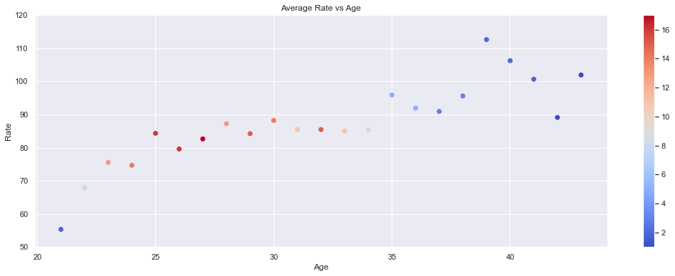
    


```python
plot_avg_var_by_year(ctrl_avg, 'Rate')
```


    
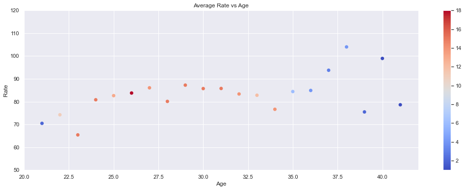
    


```python
plot_avg_var_by_year(pop_avg, 'Rate')
```


    
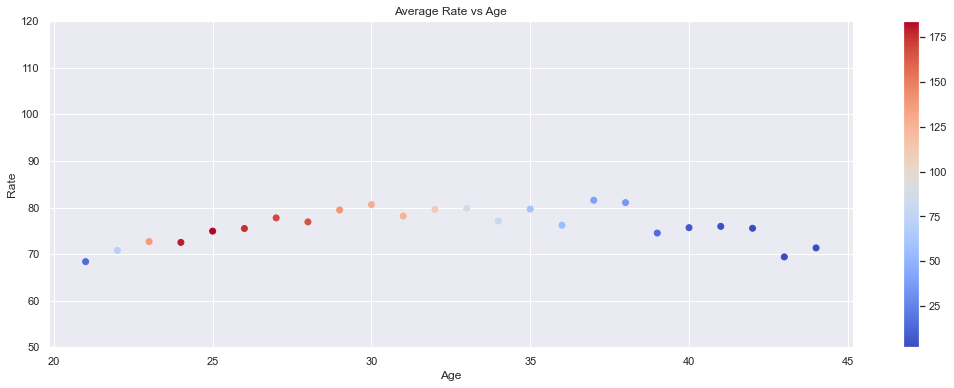
    


```python
plot_case_ctrl_pop(case_avg, ctrl_avg, pop_avg, 'Rate')
```


    

    


```python
plot_case_control_by_year(case_qbs, select_ctrls, 'Rate');
``` 


    

    


# References

1. Enger M, Skjaker SA, Nordsletten L, et al. Sports-related acute shoulder injuries in an urban population. BMJ Open Sport Exerc Med. 2019;5(1):e000551. Published 2019 Aug 12. doi:10.1136/bmjsem-2019-000551

2. Gibbs DB, Lynch TS, Nuber ED, Nuber GW. Common Shoulder Injuries in American Football Athletes. Curr Sports Med Rep. 2015 Sep-Oct;14(5):413-9. doi: 10.1249/JSR.0000000000000190. PMID: 26359844.

3. Hunter, J D. Matplotlib: A 2D Graphics Environment. Computing in Science & Engineering. 2007. 9, 90-95. 

4. Kaplan LD, Flanigan DC, Norwig J, Jost P, Bradley J. Am J Sports Med. 2005 Aug; 33(8):1142-6.

5. Katz S, Burke B. How is Total QBR calculated? We explain our quarterback rating [Internet]. ESPN. 2016 [cited 2021May11]. Available from: https://www.espn.com/blog/statsinfo/post/_/id/123701/how-is-total-qbr-calculated-we-explain-our-quarterback-rating 

6. Kelly BT, Barnes RP, Powell JW, Warren RF. Am J Sports Med. 2004 Mar; 32(2):328-31.

7. Knapp, Thomas R. and Schafer, William D. (2009) "From Gain Score t to ANCOVA F (and vice versa)," Practical Assessment, Research, and Evaluation: Vol. 14 , Article 6. DOI: https://doi.org/10.7275/yke1-k937 

8. Lanzi JT Jr, Chandler PJ, Cameron KL, Bader JM, Owens BD. Epidemiology of Posterior Glenohumeral Instability in a Young Athletic Population. Am J Sports Med. 2017 Dec;45(14):3315-3321. doi: 10.1177/0363546517725067. Epub 2017 Sep 25. PMID: 28945456.

9. Monica J, Vredenburgh Z, Korsh J, Gatt C. Acute Shoulder Injuries in Adults. Am Fam Physician. 2016 Jul 15;94(2):119-27. PMID: 27419328.

10. Morgan, C J. Use of proper statistical techniques for research studies with small samples. Am J Physiol Lung Cell Mol Physiol. Oct 2017. 313, 873-877. 

11. NCAA and NFL Passing Efficiency computation [Internet]. Stassen.com. [cited 2021May11]. Available from: http://football.stassen.com/pass-eff/ 

12. NFL Passer Rating Calculator [Internet]. ProFootballReference.com. Sports Reference LLC; [cited 2021May11]. Available from: https://www.pro-football-reference.com/about/qb-rating.htm 

13. NFL Passer Rating Career Leaders [Internet]. Pro-Football-Reference.com. Sports Reference LLC; [cited 2021May11]. Available from: https://www.pro-football-reference.com/leaders/pass_rating_career.html

14. NFL's Passer Rating [Internet]. Pro Football Hall of Fame Official Site. 2005 [cited 2021May11]. Available from: https://www.profootballhof.com/news/nfl-s-passer-rating/ 

15. NFL Quarterback Rating Formula [Internet]. QB Rating Calc - Help. NFL.com; 2011 [cited 2021May11]. Available from: https://web.archive.org/web/20110814052052/http://www.nfl.com/help/quarterbackratingformula 

16. Pallis M, Cameron KL, Svoboda SJ, Owens BD. Epidemiology of acromioclavicular joint injury in young athletes. Am J Sports Med. 2012 Sep;40(9):2072-7. doi: 10.1177/0363546512450162. Epub 2012 Jun 15. PMID: 22707749.

17. Siwoff, S., & Zimmer, J. (2010). Inside the Numbers. In The Official National Football League Record and Fact Book 2010 (Vol. 91st Season, p. 312). Reference Book, National Football League. 

18. Virtanen P, et al. SciPy 1.0: Fundamental Algorithms for Scientific Computing in Python. Nature Methods. 2020; 17(3), 261-272. 
